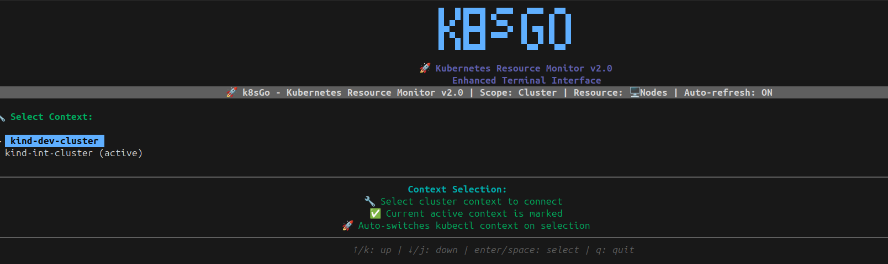
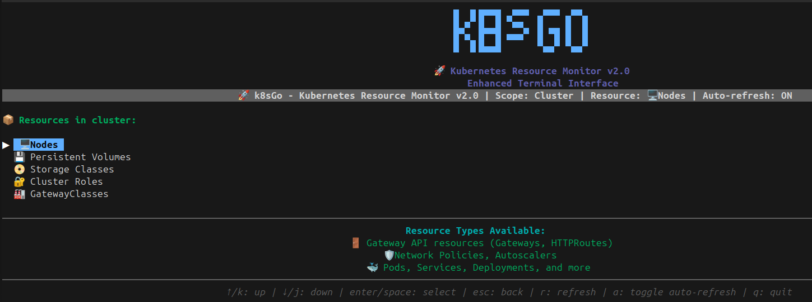
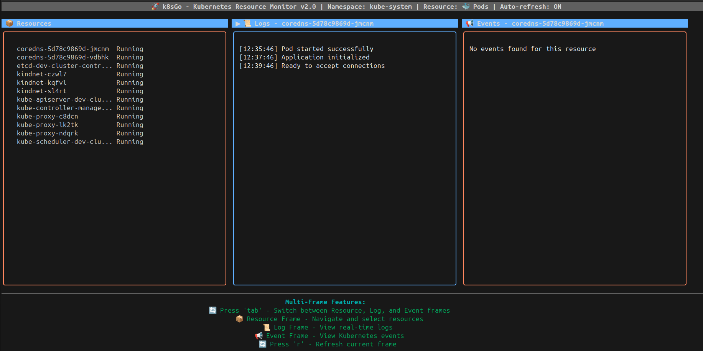

# 🚀 k8sGo - Kubernetes TUI Monitor

```
▗▖ ▗▖▄▄▄▄  ▄▄▄  ▗▄▄▖ ▗▄▖ 
▐▌ ▐▌▐▌  █▐▌   ▐▌   ▐▌ ▐▌
▐▛▀▜▌▐▛▀▀▘ ▀▀▀▖▐▌▝▜▌▐▌ ▐▌
▐▌ ▐▌▐▌   ▄▄▄▞▘▝▚▄▞▘▝▚▄▞▘
```

A modern Terminal User Interface (TUI) for monitoring Kubernetes and OpenShift clusters with multi-frame layout, real-time updates, and comprehensive resource management.

## ✨ Features

- 🎨 **Beautiful ASCII Banner** with Unicode characters
- 🔄 **Context Switching** - Switch between multiple Kubernetes contexts
- 📊 **Multi-Frame Layout** - Resources, Logs, and Events in separate frames
- 🌐 **Dual Support** - Works with both Kubernetes and OpenShift clusters
- ⚡ **Real-time Updates** - Live monitoring of cluster resources
- 🎯 **Resource Scoping** - Cluster-wide and namespace-scoped resources
- 📋 **Event Tracking** - View events related to selected resources
- 🎨 **Professional Color Scheme** - Easy on the eyes with dark theme

## 🚀 Quick Start

### Prerequisites

- Go 1.19 or later
- Access to a Kubernetes/OpenShift cluster
- `kubectl` configured with cluster access

### Installation

```bash
# Clone the repository
git clone <repository-url>
cd k8s-monitor

# Build the application
go build -o k8sgo k8sgo.go

# Run k8sGo
./k8sgo
```

### Screenshots




### First Run

1. **Start the application**: `./k8sgo`
2. **See the ASCII banner** at the top
3. **Select context** (if multiple available)
4. **Choose resource scope**:
   - 🏢 Cluster Resources (nodes, persistent volumes, etc.)
   - 📁 Namespace Resources (pods, services, deployments, etc.)
5. **Browse resources** in the multi-frame layout

## 🎮 Navigation Controls

### Global Controls
- **`q`** - Quit the application
- **`ctrl+c`** - Force quit
- **`?`** - Show help (context-sensitive)

### Context Selection
- **`↑/↓`** - Navigate contexts
- **`Enter`** - Select context
- **`q`** - Quit

### Resource Selection
- **`↑/↓`** - Navigate resource types
- **`Enter`** - Select resource type
- **`q`** - Go back/Quit

### Multi-Frame View
- **`Tab`** - Switch between frames (Resources ↔ Logs ↔ Events)
- **`↑/↓`** - Navigate within active frame
- **`Enter`** - Select resource (loads logs and events)
- **`r`** - Refresh current frame
- **`q`** - Go back to resource selection

## 🏗️ Architecture

### Frame Layout
```
┌─────────────────────────────────────────────────────────────┐
│                        k8sGo Banner                         │
├─────────────────┬─────────────────┬─────────────────────────┤
│   Resources     │      Logs       │        Events           │
│                 │                 │                         │
│ • pod1          │ [timestamp]     │ • Created pod           │
│ • pod2          │ Starting...     │ • Scheduled             │
│ • service1      │ [timestamp]     │ • Pulling image         │
│                 │ Ready           │                         │
└─────────────────┴─────────────────┴─────────────────────────┘
```

### Supported Resources

#### Kubernetes Resources
- **Cluster-scoped**: Nodes, Persistent Volumes, Storage Classes, Cluster Roles
- **Namespace-scoped**: Pods, Services, Deployments, Config Maps, Secrets, Ingresses

#### OpenShift Resources  
- **Cluster-scoped**: Projects, Cluster Role Bindings
- **Namespace-scoped**: Routes, Build Configs, Deployment Configs, Image Streams

#### Gateway API Resources
- **Cluster-scoped**: Gateway Classes
- **Namespace-scoped**: Gateways, HTTP Routes

## 🔧 Configuration

### Kubeconfig
k8sGo uses your standard kubeconfig file:
```bash
# Default location
~/.kube/config

# Custom location
export KUBECONFIG=/path/to/your/kubeconfig
```

### Multiple Contexts
If you have multiple contexts configured, k8sGo will show a selection screen:
```
Select Kubernetes Context:
▶ kind-dev-cluster (active)
  kind-int-cluster  
  production-cluster
```

## 🌈 Color Scheme

k8sGo uses a professional dark theme:

- **Primary**: Soft Blue (`#4A9EFF`) - Highlights and selections
- **Secondary**: Warm Orange (`#FF8C42`) - Accents and warnings  
- **Success**: Forest Green (`#28A745`) - Success states
- **Error**: Muted Red (`#DC3545`) - Error states
- **Background**: Dark Gray (`#1E1E1E`) - Main background
- **Text**: Light Gray (`#E5E5E5`) - Primary text
- **Muted**: Darker Gray (`#3A3A3A`) - Dividers and headers

## 🐛 Troubleshooting

### Common Issues

#### "No such host" error
```bash
Error: Get "https://kubernetes.example.com:6443/api/v1/nodes": 
dial tcp: lookup kubernetes.example.com: no such host
```
**Solution**: You need a real Kubernetes cluster. See [Cluster Setup](#cluster-setup).

#### "Connection refused"
```bash
Error: dial tcp 127.0.0.1:6443: connect: connection refused
```
**Solutions**:
- Check if your cluster is running: `kubectl get nodes`
- Verify context: `kubectl config current-context`
- For minikube: `minikube start`
- For Docker Desktop: Enable Kubernetes in settings

#### Empty resource lists
**Solutions**:
- Check permissions: `kubectl auth can-i get pods`
- Verify namespace access: `kubectl get namespaces`
- Try different resource types
- Check if resources exist: `kubectl get all`

### Debugging Steps

1. **Test kubectl connection**:
   ```bash
   kubectl get nodes
   kubectl get pods
   ```

2. **Check current context**:
   ```bash
   kubectl config current-context
   kubectl config get-contexts
   ```

3. **Verify permissions**:
   ```bash
   kubectl auth can-i get pods
   kubectl auth can-i get nodes
   ```

## 🔧 Cluster Setup

### Local Development Clusters

#### Docker Desktop
1. Open Docker Desktop
2. Settings → Kubernetes → Enable Kubernetes
3. Apply & Restart
4. Test: `kubectl get nodes`

#### Minikube
```bash
minikube start
kubectl get nodes
./k8sgo
```

#### Kind (Kubernetes in Docker)
```bash
kind create cluster --name dev-cluster
kubectl get nodes
./k8sgo
```

### Cloud Clusters

#### Google GKE
```bash
gcloud container clusters get-credentials CLUSTER_NAME
./k8sgo
```

#### AWS EKS
```bash
aws eks update-kubeconfig --name CLUSTER_NAME
./k8sgo
```

#### Azure AKS
```bash
az aks get-credentials --resource-group RG_NAME --name CLUSTER_NAME
./k8sgo
```

## 🤝 Contributing

1. Fork the repository
2. Create a feature branch: `git checkout -b feature/amazing-feature`
3. Commit changes: `git commit -m 'Add amazing feature'`
4. Push to branch: `git push origin feature/amazing-feature`
5. Open a Pull Request

## 📋 Development

### Dependencies
- `github.com/charmbracelet/bubbletea` - TUI framework
- `github.com/charmbracelet/lipgloss` - Terminal styling
- `k8s.io/client-go` - Kubernetes client
- `github.com/openshift/client-go` - OpenShift client

### Building from Source
```bash
go mod tidy
go build -o k8sgo k8sgo.go
```

### Adding New Resources
1. Add resource type to the appropriate scope (cluster/namespace)
2. Implement loading function in `loadResources()`
3. Add resource-specific formatting
4. Test with your cluster

## 📄 License

This project is licensed under the MIT License - see the LICENSE file for details.

## 🙏 Acknowledgments

- [Bubble Tea](https://github.com/charmbracelet/bubbletea) for the excellent TUI framework
- [Lipgloss](https://github.com/charmbracelet/lipgloss) for beautiful terminal styling
- Kubernetes and OpenShift communities for the APIs

---

**Happy Monitoring! 🚀**

For issues and feature requests, please open an issue on GitHub.