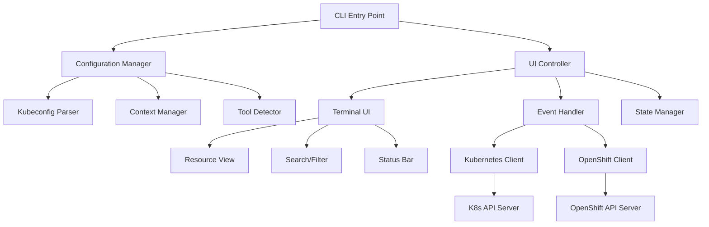

# Kubernetes/OpenShift Universal CLI Tool

## Project Overview

A cross-platform, terminal-based user interface tool for managing both Kubernetes and OpenShift clusters with an intuitive, unified experience.

## Core Requirements

### 1. Technical Specifications

#### Language & Platform
- **Language**: Go (Golang) - for cross-platform compatibility and strong Kubernetes ecosystem support
- **Platform Support**: 
  - Linux (Ubuntu, RHEL, CentOS, Fedora, SUSE)
  - Windows (10/11, Server 2019/2022)
  - macOS (Intel & Apple Silicon)

#### Configuration Management
- **Auto-discovery**: Automatically locate and parse `~/.kube/config` based on OS:
  - Linux/macOS: `$HOME/.kube/config`
  - Windows: `%USERPROFILE%\.kube\config`
- **Fallback locations**: Support `KUBECONFIG` environment variable
- **Multiple config files**: Merge multiple kubeconfig files

### 2. User Interface Requirements

#### Terminal UI Framework
- **Framework**: [Bubble Tea](https://github.com/charmbracelet/bubbletea) + [Lipgloss](https://github.com/charmbracelet/lipgloss)
- **Layout**: Framed interface similar to provided screenshot
- **Responsive**: Adapt to different terminal sizes
- **Color support**: 256-color and true color support

#### Display Components
```
┌─────────────────────────────────────────────────────────────────────┐
│  🔮 K8sgo │ v1.0.0 │ Kubernetes & OpenShift CLI Tool   │
├─ Context: cluster-name │ User: username ─────────────────────────┤
├─ Namespace: default │ Tool: kubectl/oc ──────────────────────────┤
├───────────────────────────────────────────────────────────────────┤
│ Search: [_______________] │ Filter: [All] │ Sort: [Name] │ Refresh │
├───────────────────────────────────────────────────────────────────┤
│ NAME               │ READY │ STATUS  │ RESTARTS │ CPU │ MEM │ AGE  │
│ ► pod-1            │ 1/1   │ Running │ 0        │ 10m │ 64Mi│ 5d   │
│   pod-2            │ 0/1   │ Pending │ 0        │ 0   │ 0   │ 2m   │
│   pod-3            │ 1/1   │ Running │ 1        │ 5m  │ 32Mi│ 1h   │
│   ... (47 more)    │       │         │          │     │     │      │
├───────────────────────────────────────────────────────────────────┤
│ ◄ Prev │ Page 1/3 (50/142 items) │ Next ► │ [?] Help │ [q] Quit  │
└───────────────────────────────────────────────────────────────────┘
Status: Ready │ Total: 142 │ Displayed: 50 │ Selected: pod-1
```

#### Tool Banner Requirements
- **Tool Name**: Prominent display with icon/emoji for visual identity
- **Version Display**: Current version for debugging and support
- **Subtitle**: Brief description ("Kubernetes & OpenShift CLI Tool")
- **Compact Design**: Single line to preserve screen real estate
- **Configurable**: Option to show/hide banner via config
- **Color Scheme**: Branded colors that work with terminal themes

#### Accessibility Features
- **Focus indicator**: `►` symbol shows currently selected/focused item
- **Screen reader labels**: Each UI element has semantic ARIA labels
- **Keyboard navigation**:
  - `↑/↓` or `j/k`: Navigate through resources
  - `←/→` or `h/l`: Previous/Next page
  - `/`: Focus search box
  - `Tab`: Navigate between UI sections
  - `Enter`: Select/view resource details
  - `Esc`: Return to previous view
  - `?`: Show help overlay with all shortcuts

### 3. Core Functionality

#### Auto-Detection & Tool Selection
- **Binary Detection**: Automatically detect available tools:
  ```go
  // Pseudo-code
  func detectClusterTool() (string, error) {
      if isOpenShiftCluster() && ocAvailable() {
          return "oc", nil
      }
      if kubectlAvailable() {
          return "kubectl", nil
      }
      return "", errors.New("no compatible tool found")
  }
  ```

#### Context Management
- **Auto-discovery**: List all available contexts from kubeconfig
- **Quick switching**: Keyboard shortcuts for context switching
- **Context validation**: Verify connectivity before switching
- **Multi-cluster support**: Handle multiple clusters simultaneously

#### Resource Management
- **Resource types**: Pods, Services, Deployments, ConfigMaps, Secrets, etc.
- **Real-time updates**: Configurable refresh intervals
- **Filtering & Search**: 
  - Fuzzy search across resource names
  - Status-based filtering
  - Namespace filtering
  - Label and annotation search

## Architecture Design

### 1. High-Level Architecture



### 2. Core Components

#### Configuration Layer
```go
type ConfigManager struct {
    KubeConfig     *clientcmd.Config
    CurrentContext string
    AvailableTools []string
    Settings       *UserSettings
}

type UserSettings struct {
    DefaultNamespace string
    RefreshInterval  time.Duration
    ColorScheme     string
    KeyBindings     map[string]string
}
```

#### Client Abstraction
```go
type ClusterClient interface {
    GetPods(namespace string) ([]v1.Pod, error)
    GetServices(namespace string) ([]v1.Service, error)
    GetDeployments(namespace string) ([]appsv1.Deployment, error)
    SwitchContext(context string) error
    GetContexts() ([]string, error)
}

type KubernetesClient struct {
    clientset kubernetes.Interface
    config    *rest.Config
}

type OpenShiftClient struct {
    clientset kubernetes.Interface
    ocClient  osclientset.Interface
    config    *rest.Config
}
```

#### UI State Management
```go
type AppState struct {
    CurrentView      ViewType
    SelectedResource Resource
    SearchQuery      string
    FilterCriteria   FilterOptions
    SortOrder       SortOptions
    
    // Banner and branding
    ToolName        string
    Version         string
    ShowBanner      bool
    BannerStyle     BannerStyle
    
    // Pagination state
    CurrentPage     int
    PageSize        int // Always 50
    TotalItems      int
    TotalPages      int
    
    // Accessibility state
    FocusedElement  string
    ScreenReader    bool
    HighContrast    bool
    
    Resources       []Resource
    LastUpdate      time.Time
}

type BannerStyle struct {
    Icon        string // 🔮 or custom ASCII art
    Colors      lipgloss.Style
    Compact     bool
    ShowVersion bool
}

type BannerManager struct {
    ToolName    string
    Version     string
    BuildDate   string
    GitCommit   string
    Enabled     bool
    Style       BannerStyle
}

func (b *BannerManager) RenderBanner() string {
    if !b.Enabled {
        return ""
    }
    
    banner := fmt.Sprintf("%s %s │ v%s │ Kubernetes & OpenShift CLI Tool", 
        b.Style.Icon, b.ToolName, b.Version)
    
    return b.Style.Colors.Render(banner)
}
```

### 3. Key Algorithms

#### Pagination Logic
```go
type ResourcePaginator struct {
    pageSize    int // Fixed at 50
    currentPage int
    totalItems  int
}

func (p *ResourcePaginator) PaginateResources(resources []Resource) PaginatedResult {
    totalPages := (len(resources) + p.pageSize - 1) / p.pageSize
    
    start := p.currentPage * p.pageSize
    end := start + p.pageSize
    
    if start >= len(resources) {
        return PaginatedResult{
            Items:       []Resource{},
            CurrentPage: p.currentPage,
            TotalPages:  totalPages,
            TotalItems:  len(resources),
            HasNext:     false,
            HasPrev:     p.currentPage > 0,
        }
    }
    
    if end > len(resources) {
        end = len(resources)
    }
    
    return PaginatedResult{
        Items:       resources[start:end],
        CurrentPage: p.currentPage,
        TotalPages:  totalPages,
        TotalItems:  len(resources),
        HasNext:     p.currentPage < totalPages-1,
        HasPrev:     p.currentPage > 0,
    }
}
```

#### Accessibility Navigation
```go
func (a *AccessibilityManager) HandleKeyboardNavigation(key string, state *AppState) {
    switch key {
    case "j", "ArrowDown":
        a.NavigateDown(state)
        a.AnnounceSelection(state.SelectedResource)
    case "k", "ArrowUp":
        a.NavigateUp(state)
        a.AnnounceSelection(state.SelectedResource)
    case "h", "ArrowLeft":
        if state.CurrentPage > 0 {
            state.CurrentPage--
            a.Announce(fmt.Sprintf("Page %d of %d", state.CurrentPage+1, state.TotalPages))
        }
    case "l", "ArrowRight":
        if state.CurrentPage < state.TotalPages-1 {
            state.CurrentPage++
            a.Announce(fmt.Sprintf("Page %d of %d", state.CurrentPage+1, state.TotalPages))
        }
    case "?":
        a.ShowHelpOverlay()
    }
}

func (a *AccessibilityManager) AnnounceSelection(resource Resource) {
    if a.ScreenReaderEnabled {
        announcement := fmt.Sprintf("Selected %s, status %s, %s", 
            resource.Name, resource.Status, resource.Description)
        a.AnnouncementQueue = append(a.AnnouncementQueue, announcement)
    }
}
```

#### Tool Detection Strategy
```go
func DetectClusterType(client kubernetes.Interface) (string, error) {
    // Check for OpenShift-specific resources
    _, err := client.Discovery().ServerResourcesForGroupVersion("route.openshift.io/v1")
    if err == nil {
        return "openshift", nil
    }
    
    // Check for OpenShift API groups
    groups, err := client.Discovery().ServerGroups()
    if err != nil {
        return "", err
    }
    
    for _, group := range groups.Groups {
        if strings.Contains(group.Name, "openshift") {
            return "openshift", nil
        }
    }
    
    return "kubernetes", nil
}
```

## Missing Requirements Analysis

### Critical Additions Needed:

#### 1. **Performance & Scalability**
- **Pagination**: Display maximum 50 records per page for all resource types
- **Page navigation**: Implement Previous/Next page controls with page indicators
- **Background refresh**: Non-blocking resource updates with loading indicators
- **Caching strategy**: Cache frequently accessed data with configurable TTL
- **Connection pooling**: Efficient API client management
- **Memory optimization**: Release unused resources and implement garbage collection hints

#### 2. **Accessibility & User Experience**
- **Screen reader support**: ARIA labels and semantic navigation for terminal UI
- **Keyboard-only navigation**: Complete functionality without mouse dependency
- **Focus indicators**: Clear visual focus indicators for all interactive elements  
- **High contrast mode**: Support for high contrast color schemes
- **Keyboard shortcuts**: Intuitive shortcuts with help overlay
- **Voice feedback**: Audio cues for state changes and important events

#### 3. **Error Handling & Resilience**
- **Connection recovery**: Auto-reconnect on network issues
- **Graceful degradation**: Partial functionality when API is limited
- **User feedback**: Clear error messages and recovery suggestions
- **Logging system**: Debug logs and audit trails

#### 4. **User Experience Enhancements**
- **Pagination controls**: Intuitive page navigation with visual indicators
- **Keyboard shortcuts**: Full keyboard navigation with help overlay
- **Customization**: User-defined views, color schemes, and key bindings
- **Export functionality**: Save resource data (JSON/YAML/CSV)
- **Help system**: Built-in documentation with searchable shortcuts
- **Responsive layout**: Adapt to different terminal sizes and orientations

#### 6. **Branding & Tool Identity**
- **Tool banner**: Prominent display with name, version, and description
- **Visual identity**: Consistent icon/emoji usage (🔮 or custom ASCII art)
- **Version information**: Build version, date, and Git commit for debugging
- **Configurable display**: Option to show/hide banner for compact mode
- **Terminal branding**: Color scheme that works across different terminal themes
- **Professional appearance**: Clean, modern design that inspires confidence

#### 7. **Advanced Features**
- **Resource actions**: Edit, delete, scale resources
- **Log viewing**: Stream pod logs in real-time
- **Port forwarding**: Built-in port forwarding management
- **Multi-namespace**: Simultaneous multi-namespace view
- **Metrics integration**: CPU/Memory usage display

## Implementation Phases

### Phase 1: Core Foundation (4-6 weeks)
- Basic Go project structure
- Kubeconfig parsing and context management
- Simple terminal UI with resource listing
- Basic kubectl/oc detection

### Phase 2: Enhanced UI (3-4 weeks)
- Advanced terminal UI with frames and colors
- Search and filtering functionality
- Keyboard navigation and shortcuts
- Real-time updates

### Phase 3: Advanced Features (4-6 weeks)
- Authentication improvements
- Performance optimizations
- Resource actions (view details, logs)
- Error handling and resilience

### Phase 4: Polish & Production (2-3 weeks)
- Comprehensive testing
- Documentation and help system
- Installation packages
- Configuration management

## Technical Dependencies

### Core Libraries
```go
// Kubernetes/OpenShift clients
"k8s.io/client-go"
"github.com/openshift/client-go"

// Terminal UI with accessibility
"github.com/charmbracelet/bubbletea"
"github.com/charmbracelet/lipgloss"
"github.com/charmbracelet/bubbles/paginator" // For pagination controls
"github.com/charmbracelet/bubbles/help"      // For help system

// Configuration and utilities
"github.com/spf13/cobra"     // CLI framework
"github.com/spf13/viper"     // Configuration management
"gopkg.in/yaml.v3"           // YAML parsing

// Accessibility and performance
"golang.org/x/term"          // Terminal feature detection
"github.com/mattn/go-isatty"  // TTY detection for screen readers
"github.com/gdamore/tcell/v2" // Advanced terminal control
```

### Development Tools
- **Testing**: Testify, Ginkgo for Kubernetes-style tests
- **Building**: GoReleaser for cross-platform builds
- **CI/CD**: GitHub Actions with matrix builds
- **Documentation**: MkDocs or GitBook

## Success Metrics

### Primary Goals
1. **Compatibility**: Works with 95% of standard K8s/OpenShift clusters
2. **Performance**: Sub-second response time for resource listing
3. **Usability**: New users productive within 5 minutes
4. **Reliability**: 99.9% uptime with graceful error handling

### Secondary Goals
1. **Adoption**: 1000+ active users within 6 months
2. **Contribution**: Active open-source community
3. **Platform coverage**: All major OS distributions supported
4. **Feature completeness**: 80% feature parity with kubectl/oc

## Risk Assessment

### High Risk
- **API compatibility**: Breaking changes in Kubernetes APIs
- **Authentication complexity**: Various auth methods across clusters
- **Performance with large clusters**: Memory and CPU usage

### Medium Risk
- **Cross-platform testing**: Ensuring consistent behavior
- **Terminal compatibility**: Different terminal emulators
- **User adoption**: Competition with existing tools

### Mitigation Strategies
- Comprehensive testing with multiple cluster versions
- Modular authentication system with plugin support
- Performance profiling and optimization from day one
- Strong documentation and user onboarding